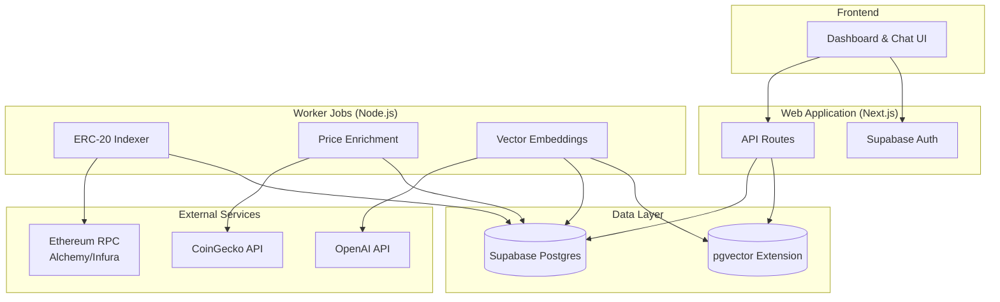
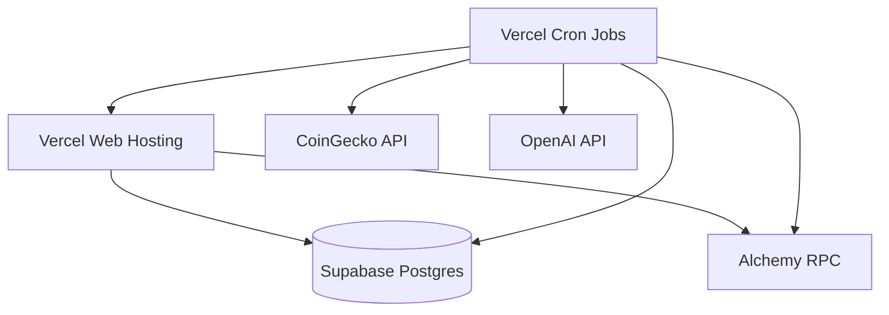

## Overview

Cogniflow is built as a **monorepo** with two primary workspaces that work together to deliver on-chain intelligence:

<CardGroup cols={2}>
  <Card title="Web Application" icon="browser">
    Next.js 15 app with React 19, API routes, and UI components
  </Card>
  <Card title="Worker Jobs" icon="gears">
    Node.js scripts for indexing, price enrichment, and embeddings
  </Card>
</CardGroup>

```
cogniflow/
├── web/              # Next.js 15 frontend and API routes
├── worker/           # Node.js background jobs
├── shared/           # Shared utilities (Prisma client, etc.)
├── prisma/           # Database schema and migrations
├── package.json      # npm workspaces configuration
└── .env.example      # Environment variable template
```

<Info>
  The project uses **npm workspaces** for managing dependencies across multiple packages. Always install from the root with `npm install`.
</Info>

## System Architecture



## Core Components

### 1. Web Application

The web workspace contains the Next.js 15 application with server and client components.

#### Technology Stack

<CodeGroup>
```json web/package.json
{
  "name": "web",
  "dependencies": {
    "@prisma/client": "^6.17.0",
    "@supabase/auth-helpers-nextjs": "^0.10.0",
    "@supabase/ssr": "^0.7.0",
    "@supabase/supabase-js": "^2.75.0",
    "next": "15.5.4",
    "react": "19.1.0",
    "react-dom": "19.1.0"
  }
}
```
</CodeGroup>

#### Key Features

<AccordionGroup>
  <Accordion title="Dashboard Component" icon="chart-line">
    The main dashboard (`components/dashboard.tsx`) provides:
    - Wallet address input with instant ingestion
    - Portfolio summary cards (transfers, counterparties, USD value)
    - Top token holdings ranked by net value
    - Latest transfers table with Etherscan links
    - Real-time sync status display

    ```typescript components/dashboard.tsx
    const DEMO_ADDRESS = "0xabc123abc123abc123abc123abc123abc123abc1";
    const DEFAULT_CHAIN = process.env.NEXT_PUBLIC_DEFAULT_CHAIN?.toLowerCase() ?? "eth";

    export function Dashboard() {
      const [address, setAddress] = useState(DEMO_ADDRESS);
      const [portfolio, setPortfolio] = useState<PortfolioResponse["data"] | null>(null);
      // ... rest of component
    }
    ```
  </Accordion>

  <Accordion title="Chat Interface" icon="comments">
    Natural language chat powered by LLM tool use:
    - Accepts plain English questions
    - Executes deterministic SQL tools
    - Performs semantic search over embeddings
    - Returns structured tables and sources
    - Debug mode for tool execution traces

    Example queries:
    - "What were my largest outgoing USDT transfers last week?"
    - "Show top counterparties over the last 30 days"
    - "Find transfers related to DeFi protocols"
  </Accordion>

  <Accordion title="API Routes" icon="code">
    Next.js API routes provide REST endpoints:

    | Endpoint | Method | Purpose |
    |----------|--------|----------|
    | `/api/healthz` | GET | Database connectivity check |
    | `/api/portfolio` | GET | Aggregated balances and metrics |
    | `/api/transfers` | GET | Paginated transfer history |
    | `/api/search` | GET | Semantic search over embeddings |
    | `/api/chat` | POST | Chat orchestrator with LLM tools |
    | `/api/wallets` | POST | Upsert wallet and trigger ingestion |
    | `/api/ingest` | POST | Manual ingestion trigger (requires auth) |
    | `/api/prices` | POST | Price enrichment job (requires auth) |
    | `/api/embeddings` | POST | Embedding generation (requires auth) |

    <Note>
      Job endpoints (`/api/ingest`, `/api/prices`, `/api/embeddings`) require `Authorization: Bearer <INGESTION_SECRET>` header.
    </Note>
  </Accordion>

  <Accordion title="Authentication" icon="lock">
    Supabase Auth integration with server-side client:

    ```typescript lib/supabase/server-client.ts
    import { cookies } from "next/headers";
    import { createServerClient } from "@supabase/ssr";

    export async function createServerSupabaseClient() {
      const url = process.env.NEXT_PUBLIC_SUPABASE_URL;
      const anonKey = process.env.NEXT_PUBLIC_SUPABASE_ANON_KEY;

      if (!url || !anonKey) {
        throw new Error("Supabase environment variables are not set.");
      }

      const cookieStore = await cookies();

      return createServerClient(url, anonKey, {
        cookies: {
          get(name: string) {
            return cookieStore.get(name)?.value;
          },
          // ... cookie handlers
        },
      });
    }
    ```

    Protected routes redirect to `/signin` if no session exists:

    ```typescript app/page.tsx
    export default async function Home() {
      const supabase = await createServerSupabaseClient();
      const { data: { session } } = await supabase.auth.getSession();

      if (!session) {
        redirect("/signin");
      }

      return <Dashboard />;
    }
    ```
  </Accordion>
</AccordionGroup>

### 2. Worker Jobs

Background jobs run as standalone Node.js scripts, scheduled via Vercel Cron or other schedulers.

#### Indexer (`worker/src/indexer.ts`)

Ingests ERC-20 transfers for all tracked wallets:

```typescript worker/src/indexer.ts
import "dotenv/config";
import pino from "pino";
import prisma, { disconnectPrisma } from "../../shared/prisma";
import { syncWalletTransfers } from "../../shared/ingestion/syncWalletTransfers";

const log = pino({ level: process.env.LOG_LEVEL || "info" });

async function main() {
  log.info("Indexer booting...");

  const targetChain = process.env.ETH_CHAIN ?? "eth";
  const wallets = await prisma.wallet.findMany({
    where: { chain: targetChain },
  });

  if (wallets.length === 0) {
    log.warn({ chain: targetChain }, "No wallets registered for ingestion");
    return;
  }

  for (const wallet of wallets) {
    const childLog = log.child({ wallet: wallet.address, chain: wallet.chain });
    try {
      await syncWalletTransfers(wallet, childLog);
    } catch (error) {
      childLog.error({ err: error }, "Failed to sync wallet");
    }
  }
}
```

<Note>
  The indexer is **idempotent** - transfers are upserted by `txHash:logIndex` so re-running is safe.
</Note>

#### Price Enrichment (`worker/src/jobs/updatePrices.ts`)

Fetches USD prices from CoinGecko for tokens seen on-chain:

- Queries distinct tokens from the `transfers` table
- Calls CoinGecko API for current prices
- Inserts timestamped price snapshots into `prices` table
- Free tier: 1 token per request (set `PRICE_BATCH_SIZE=1`)
- Pro tier: batch multiple tokens per request

<Warning>
  CoinGecko free tier has rate limits. For production, consider upgrading or adding delays between requests.
</Warning>

#### Embeddings Generation (`worker/src/jobs/updateEmbeddings.ts`)

Generates OpenAI embeddings for semantic search:

- Queries transfers without embeddings (`LEFT JOIN tx_embeddings WHERE tx_embeddings.id IS NULL`)
- Constructs descriptive text for each transfer (symbol, amount, addresses, timestamp)
- Calls OpenAI Embeddings API (`text-embedding-3-small` by default)
- Stores 768-dimensional vectors in `tx_embeddings` table via pgvector

```typescript
const embeddingText = `${transfer.symbol ?? 'token'} transfer of ${transfer.amountDec} from ${transfer.fromAddr} to ${transfer.toAddr} at ${transfer.timestamp}`;
```

<Tip>
  Adjust `EMBEDDING_BATCH_SIZE` based on your OpenAI tier. Start with 32 for free tier.
</Tip>

### 3. Database Schema

Postgres database with Prisma ORM, hosted on Supabase.

#### Schema Overview

<CodeGroup>
```prisma prisma/schema.prisma
generator client {
  provider = "prisma-client-js"
}

datasource db {
  provider  = "postgresql"
  url       = env("DATABASE_URL")
  directUrl = env("DIRECT_URL")
}

model Block {
  number     Int        @id
  hash       String     @unique
  parentHash String     @map("parent_hash")
  timestamp  DateTime
  createdAt  DateTime   @default(now()) @map("created_at")
  updatedAt  DateTime   @updatedAt @map("updated_at")
  transfers  Transfer[]

  @@map("blocks")
}

model Transfer {
  id          String       @id
  blockNumber Int?         @map("block_number")
  timestamp   DateTime
  txHash      String       @map("tx_hash")
  logIndex    Int          @map("log_index")
  token       String
  fromAddr    String       @map("from_addr")
  toAddr      String       @map("to_addr")
  amountRaw   Decimal      @map("amount_raw") @db.Decimal(78, 0)
  amountDec   Decimal      @map("amount_dec") @db.Decimal(78, 18)
  symbol      String?
  decimals    Int?
  chain       String
  stale       Boolean      @default(false)
  createdAt   DateTime     @default(now()) @map("created_at")
  updatedAt   DateTime     @updatedAt @map("updated_at")
  block       Block?       @relation(fields: [blockNumber], references: [number])
  embedding   TxEmbedding?

  @@index([toAddr])
  @@index([fromAddr])
  @@index([token])
  @@index([blockNumber])
  @@map("transfers")
}

model PriceSnapshot {
  chain     String
  token     String
  timestamp DateTime @map("ts")
  usd       Decimal  @db.Decimal(38, 10)
  createdAt DateTime @default(now()) @map("created_at")

  @@id([chain, token, timestamp])
  @@map("prices")
}

model TxEmbedding {
  id        String                     @id
  embedding Unsupported("vector(768)")
  meta      Json?
  createdAt DateTime                   @default(now()) @map("created_at")
  transfer  Transfer                   @relation(fields: [id], references: [id], onDelete: Cascade)

  @@map("tx_embeddings")
}

model User {
  id        String   @id @default(uuid()) @db.Uuid
  email     String   @unique
  createdAt DateTime @default(now()) @map("created_at")
  wallets   Wallet[]

  @@map("users")
}

model Wallet {
  id              String    @id @default(uuid()) @db.Uuid
  userId          String    @map("user_id") @db.Uuid
  chain           String
  address         String
  lastSyncedBlock Int?      @map("last_synced_block")
  lastSyncedAt    DateTime? @map("last_synced_at")
  createdAt       DateTime  @default(now()) @map("created_at")
  user            User      @relation(fields: [userId], references: [id], onDelete: Cascade)

  @@unique([userId, chain, address])
  @@map("wallets")
}
```
</CodeGroup>

#### Key Tables

<AccordionGroup>
  <Accordion title="blocks" icon="cube">
    Stores Ethereum block headers:
    - `number` (PK): Block number
    - `hash`: Block hash
    - `parentHash`: Previous block hash
    - `timestamp`: Block timestamp

    <Info>
      Used for temporal queries and ensuring data consistency.
    </Info>
  </Accordion>

  <Accordion title="transfers" icon="arrow-right-arrow-left">
    ERC-20 transfer events:
    - `id` (PK): Composite key `txHash:logIndex`
    - `txHash`, `logIndex`: Uniquely identify the event
    - `token`, `fromAddr`, `toAddr`: Transfer details
    - `amountRaw`, `amountDec`: Raw and decimal-adjusted amounts
    - `symbol`, `decimals`: Token metadata (nullable)
    - `chain`: Network identifier (`eth`, `sepolia`)
    - `stale`: Flag for re-indexing invalidated data

    Indexes on `toAddr`, `fromAddr`, `token`, and `blockNumber` for fast queries.
  </Accordion>

  <Accordion title="prices" icon="dollar-sign">
    USD price snapshots from CoinGecko:
    - Composite PK: `(chain, token, timestamp)`
    - `usd`: Price in USD (Decimal 38,10)
    - `createdAt`: Ingestion timestamp

    <Tip>
      Prices are stored per-chain to support multi-network tokens.
    </Tip>
  </Accordion>

  <Accordion title="tx_embeddings" icon="vector-square">
    Vector embeddings for semantic search:
    - `id` (PK, FK): References `transfers.id`
    - `embedding`: 768-dimensional vector (pgvector)
    - `meta`: Optional JSON metadata
    - Cascade deletes when transfer is removed

    Requires pgvector extension:
    ```sql
    CREATE EXTENSION IF NOT EXISTS vector;
    ```
  </Accordion>

  <Accordion title="users" icon="user">
    Authenticated users from Supabase Auth:
    - `id` (PK, UUID): Supabase user ID
    - `email`: User email
    - One-to-many relation with `wallets`
  </Accordion>

  <Accordion title="wallets" icon="wallet">
    User-owned Ethereum addresses:
    - `id` (PK, UUID): Internal ID
    - `userId` (FK): References `users.id`
    - `chain`, `address`: Network and address
    - `lastSyncedBlock`, `lastSyncedAt`: Sync cursor
    - Unique constraint on `(userId, chain, address)`

    <Note>
      Wallets are automatically created when a user submits a new address via the dashboard.
    </Note>
  </Accordion>
</AccordionGroup>

## Data Flow

### Ingestion Pipeline

<Steps>
  <Step title="User Submits Address">
    User enters an Ethereum address in the dashboard and clicks "Load activity".
  </Step>

  <Step title="Wallet Upsert">
    Frontend calls `POST /api/wallets` with `{ address, chain }`. API:
    1. Validates user session
    2. Upserts wallet in `wallets` table (linked to user)
    3. Triggers lightweight ingestion (last 1500 blocks, max 2 pages)
    4. Returns wallet metadata and sync status
  </Step>

  <Step title="RPC Query">
    Ingestion worker:
    1. Queries Ethereum RPC for ERC-20 `Transfer` events matching the address
    2. Fetches token metadata (symbol, decimals) via ERC-20 contract calls
    3. Handles RPC rate limits with exponential backoff
  </Step>

  <Step title="Database Insert">
    Worker upserts transfers:
    ```typescript
    await prisma.transfer.upsert({
      where: { id: `${txHash}:${logIndex}` },
      create: { /* transfer data */ },
      update: { /* update if exists */ },
    });
    ```
  </Step>

  <Step title="Frontend Refresh">
    Dashboard polls `/api/portfolio` and `/api/transfers` to display updated data.
  </Step>
</Steps>

### Chat Query Flow

<Steps>
  <Step title="User Asks Question">
    User submits a natural language question in the chat panel.
  </Step>

  <Step title="LLM Tool Selection">
    `POST /api/chat` orchestrator:
    1. Passes question + conversation history to LLM
    2. LLM decides which tools to invoke (named SQL queries, semantic search)
    3. Tools are executed deterministically (no arbitrary SQL)
  </Step>

  <Step title="Tool Execution">
    For SQL tools:
    - Execute pre-defined parameterized queries from `lib/tools/sqlQueries.ts`
    - Return structured rows

    For semantic search:
    - Generate embedding for the query via OpenAI
    - Perform cosine similarity search via pgvector
    - Return top-k matching transfers
  </Step>

  <Step title="Response Generation">
    LLM synthesizes tool results into natural language answer with:
    - Textual summary
    - Data tables (columns + rows)
    - Source attribution (which tools were used)
    - Optional debug metadata
  </Step>

  <Step title="Display in UI">
    Dashboard renders the answer, tables, and sources in the chat interface.
  </Step>
</Steps>

## Configuration

Environment variables control system behavior:

<CodeGroup>
```bash .env.example
# Database
DATABASE_URL="postgresql://..."
DIRECT_URL="postgresql://..."

# Supabase Auth
NEXT_PUBLIC_SUPABASE_URL="https://[project-id].supabase.co"
NEXT_PUBLIC_SUPABASE_ANON_KEY="[anon-key]"

# Ethereum RPC
ETH_RPC_URL="https://eth-mainnet.g.alchemy.com/v2/[api-key]"
ETH_CHAIN="eth"
ETH_LOOKBACK_BLOCKS="5000"

# RPC Retry Settings
RPC_MAX_RETRIES="5"
RPC_RETRY_BASE_MS="300"
RPC_RETRY_MAX_MS="4500"

# Ingestion Settings
INGESTION_BATCH_SIZE="1"
INGESTION_MAX_PAGES="8"
INGESTION_MAX_BLOCK_SPAN="50000"
INGESTION_SKIP_RECENT_MS="600000"

# UI-triggered Sync
UI_SYNC_MAX_PAGES="2"
UI_SYNC_LOOKBACK_BLOCKS="1500"
UI_SYNC_MIN_INTERVAL_MS="300000"

# Job Authentication
INGESTION_SECRET="[random-secret]"

# Price Enrichment
PRICE_CHAIN="eth"
PRICE_BATCH_SIZE="1"
COINGECKO_API_KEY="[optional]"

# Embeddings
EMBEDDING_MODEL="text-embedding-3-small"
EMBEDDING_CHAIN="eth"
EMBEDDING_BATCH_SIZE="32"
EMBEDDING_DIM="768"
OPENAI_API_KEY="[your-key]"
OPENAI_BASE_URL="https://api.openai.com/v1"

# UI
NEXT_PUBLIC_ETHERSCAN_BASE_URL="https://etherscan.io"
NEXT_PUBLIC_DEFAULT_CHAIN="eth"
LOG_LEVEL="info"
```
</CodeGroup>

<Tip>
  See the [Configuration guide](/configuration) for detailed explanations of each variable.
</Tip>

## Deployment Architecture

### Production Setup



<Steps>
  <Step title="Deploy Web App">
    Deploy the `web/` workspace to Vercel:
    - Connect GitHub repository
    - Set root directory to `web/`
    - Configure environment variables in Vercel dashboard
    - Enable automatic deployments on push
  </Step>

  <Step title="Schedule Worker Jobs">
    Use Vercel Cron to call job endpoints:
    ```json vercel.json
    {
      "crons": [
        {
          "path": "/api/ingest",
          "schedule": "0 * * * *"
        },
        {
          "path": "/api/prices",
          "schedule": "0 * * * *"
        },
        {
          "path": "/api/embeddings",
          "schedule": "0 */6 * * *"
        }
      ]
    }
    ```

    <Warning>
      Set `INGESTION_SECRET` in Vercel environment variables and include `Authorization: Bearer <secret>` header in cron requests.
    </Warning>
  </Step>

  <Step title="Configure Database">
    In Supabase:
    - Run Prisma migrations: `npx prisma migrate deploy`
    - Enable pgvector extension
    - Set connection pooling for optimal performance
  </Step>

  <Step title="Set Production Environment Variables">
    Update `.env` variables for production:
    - Use production RPC endpoints (not dev/test)
    - Increase `INGESTION_MAX_PAGES` and `INGESTION_MAX_BLOCK_SPAN` for scheduled jobs
    - Set secure `INGESTION_SECRET`
    - Configure Supabase redirect URLs to include production domain
  </Step>
</Steps>

<Info>
  See the [Deployment guide](/deployment) for complete setup instructions.
</Info>

## Performance Considerations

<CardGroup cols={2}>
  <Card title="Database Indexes" icon="bolt">
    Indexes on `toAddr`, `fromAddr`, `token`, and `blockNumber` ensure fast queries even with millions of transfers.
  </Card>
  <Card title="RPC Rate Limits" icon="gauge">
    Exponential backoff and configurable batch sizes prevent hitting Alchemy/Infura limits.
  </Card>
  <Card title="Pagination" icon="arrows-left-right">
    All list endpoints support cursor-based pagination to handle large result sets efficiently.
  </Card>
  <Card title="Incremental Sync" icon="rotate">
    Wallets store `lastSyncedBlock` cursor to avoid re-indexing historical data on every run.
  </Card>
</CardGroup>

## Security

<Warning>
  **Never commit `.env` files to version control.** Use `.env.example` as a template and populate secrets locally.
</Warning>

<AccordionGroup>
  <Accordion title="Authentication" icon="lock">
    - All dashboard routes require Supabase Auth session
    - Job endpoints require `INGESTION_SECRET` bearer token
    - User-scoped wallet access (users only see their own wallets)
  </Accordion>

  <Accordion title="Read-Only Blockchain Access" icon="book-open">
    - No transaction signing or private key handling
    - RPC calls are read-only queries (no state changes)
    - Safe for multi-tenant environments
  </Accordion>

  <Accordion title="SQL Injection Prevention" icon="shield">
    - Prisma ORM prevents SQL injection
    - Chat LLM can only invoke pre-defined named queries
    - No arbitrary SQL execution from user input
  </Accordion>
</AccordionGroup>

## Scalability

Cogniflow is designed to scale from single-user development to multi-tenant production:

| Component | Scaling Strategy |
|-----------|------------------|
| **Web App** | Vercel auto-scales serverless functions |
| **Database** | Supabase supports connection pooling and read replicas |
| **Workers** | Run multiple instances in parallel (one per wallet or chain) |
| **RPC** | Use multiple providers (Alchemy + Infura) with fallback logic |
| **Storage** | Partition `transfers` table by chain or time range for large datasets |

<Tip>
  For high-volume production, consider:
  - Splitting workers by chain (separate `eth` and `sepolia` jobs)
  - Using Redis for caching frequently accessed portfolio data
  - Setting up read replicas for analytics queries
</Tip>

## Next Steps

<CardGroup cols={2}>
  <Card
    title="API Reference"
    icon="code"
    href="/api/overview"
  >
    Explore all available endpoints and parameters
  </Card>
  <Card
    title="Configuration"
    icon="gear"
    href="/setup/environment-variables"
  >
    Fine-tune RPC settings, sync windows, and job schedules
  </Card>
  <Card
    title="Deployment"
    icon="rocket"
    href="/deployment/vercel"
  >
    Deploy to Vercel with scheduled workers
  </Card>
  <Card
    title="Contributing"
    icon="code-branch"
    href="/dev/contributing"
  >
    Learn how to contribute to Cogniflow
  </Card>
</CardGroup>