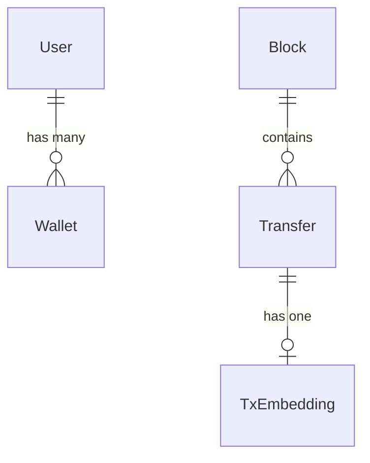

Cogniflow uses **Prisma** with **PostgreSQL** and the **pgvector** extension for storing blockchain data, user information, and vector embeddings.

## Schema overview

The database schema is defined in `prisma/schema.prisma`:

```prisma
generator client {
  provider = "prisma-client-js"
}

datasource db {
  provider  = "postgresql"
  url       = env("DATABASE_URL")
  directUrl = env("DIRECT_URL")
}
```

## Tables

### User

**Purpose:** Stores authenticated users from Supabase Auth

```prisma
model User {
  id        String   @id @default(uuid()) @db.Uuid
  email     String   @unique
  createdAt DateTime @default(now()) @map("created_at")
  wallets   Wallet[]

  @@map("users")
}
```

**Fields:**
- `id` - UUID primary key (auto-generated)
- `email` - Unique email address
- `createdAt` - Account creation timestamp
- `wallets` - One-to-many relationship with tracked wallets

### Wallet

**Purpose:** Tracks Ethereum wallets associated with users

```prisma
model Wallet {
  id              String    @id @default(uuid()) @db.Uuid
  userId          String    @map("user_id") @db.Uuid
  chain           String
  address         String
  lastSyncedBlock Int?      @map("last_synced_block")
  lastSyncedAt    DateTime? @map("last_synced_at")
  createdAt       DateTime  @default(now()) @map("created_at")
  user            User      @relation(fields: [userId], references: [id], onDelete: Cascade)

  @@unique([userId, chain, address])
  @@map("wallets")
}
```

**Fields:**
- `id` - UUID primary key
- `userId` - Foreign key to `users.id`
- `chain` - Blockchain identifier (e.g., "eth")
- `address` - Ethereum address (0x-prefixed hex)
- `lastSyncedBlock` - Last indexed block number for this wallet
- `lastSyncedAt` - Timestamp of last sync
- `createdAt` - Wallet tracking start date

**Unique constraint:** Each user can track the same address only once per chain.

### Block

**Purpose:** Stores blockchain block metadata

```prisma
model Block {
  number     Int        @id
  hash       String     @unique
  parentHash String     @map("parent_hash")
  timestamp  DateTime
  createdAt  DateTime   @default(now()) @map("created_at")
  updatedAt  DateTime   @updatedAt @map("updated_at")
  transfers  Transfer[]

  @@map("blocks")
}
```

**Fields:**
- `number` - Block number (primary key)
- `hash` - Block hash (unique)
- `parentHash` - Previous block hash
- `timestamp` - Block timestamp from chain
- `transfers` - One-to-many relationship with transfers

### Transfer

**Purpose:** Stores ERC-20 transfer events

```prisma
model Transfer {
  id          String       @id
  blockNumber Int?         @map("block_number")
  timestamp   DateTime
  txHash      String       @map("tx_hash")
  logIndex    Int          @map("log_index")
  token       String
  fromAddr    String       @map("from_addr")
  toAddr      String       @map("to_addr")
  amountRaw   Decimal      @map("amount_raw") @db.Decimal(78, 0)
  amountDec   Decimal      @map("amount_dec") @db.Decimal(78, 18)
  symbol      String?
  decimals    Int?
  chain       String
  stale       Boolean      @default(false)
  createdAt   DateTime     @default(now()) @map("created_at")
  updatedAt   DateTime     @updatedAt @map("updated_at")
  block       Block?       @relation(fields: [blockNumber], references: [number])
  embedding   TxEmbedding?

  @@index([toAddr])
  @@index([fromAddr])
  @@index([token])
  @@index([blockNumber])
  @@map("transfers")
}
```

**Fields:**
- `id` - Composite ID: `{txHash}:{logIndex}`
- `blockNumber` - Block number (foreign key to `blocks.number`)
- `timestamp` - Block timestamp
- `txHash` - Transaction hash
- `logIndex` - Event log index within transaction
- `token` - ERC-20 token contract address
- `fromAddr` - Sender address
- `toAddr` - Receiver address
- `amountRaw` - Raw amount (wei/smallest unit)
- `amountDec` - Decimal-adjusted amount
- `symbol` - Token symbol (e.g., "USDC")
- `decimals` - Token decimals (e.g., 18)
- `chain` - Blockchain identifier
- `stale` - Flag for outdated records

**Indexes:** Optimized for queries by `toAddr`, `fromAddr`, `token`, and `blockNumber`.

### TxEmbedding

**Purpose:** Stores OpenAI vector embeddings for semantic search

```prisma
model TxEmbedding {
  id        String                     @id
  embedding Unsupported("vector(768)")
  meta      Json?
  createdAt DateTime                   @default(now()) @map("created_at")
  transfer  Transfer                   @relation(fields: [id], references: [id], onDelete: Cascade)

  @@map("tx_embeddings")
}
```

**Fields:**
- `id` - Foreign key to `transfers.id`
- `embedding` - 768-dimensional pgvector (for `text-embedding-3-small`)
- `meta` - Optional metadata (JSON)
- `createdAt` - Embedding generation timestamp

<Info>
  The `embedding` field uses the **pgvector** extension. Ensure the extension is enabled:
  ```sql
  CREATE EXTENSION IF NOT EXISTS vector;
  ```
</Info>

### PriceSnapshot

**Purpose:** Stores USD price data for ERC-20 tokens

```prisma
model PriceSnapshot {
  chain     String
  token     String
  timestamp DateTime @map("ts")
  usd       Decimal  @db.Decimal(38, 10)
  createdAt DateTime @default(now()) @map("created_at")

  @@id([chain, token, timestamp])
  @@map("prices")
}
```

**Fields:**
- `chain` - Blockchain identifier
- `token` - Token contract address
- `timestamp` - Price snapshot time (rounded to hour)
- `usd` - USD price
- `createdAt` - Record creation timestamp

**Composite primary key:** `(chain, token, timestamp)` ensures one price per token per hour.

## Relationships



- **User → Wallet**: One user can track multiple wallets
- **Block → Transfer**: One block contains many transfers
- **Transfer → TxEmbedding**: One transfer can have one embedding (optional)

## Database indexes

### Transfer table indexes

The `transfers` table has indexes on frequently queried fields:

- `toAddr` - For querying incoming transfers
- `fromAddr` - For querying outgoing transfers
- `token` - For filtering by token contract
- `blockNumber` - For time-based queries and pagination

<Tip>
  These indexes are **critical** for API performance when querying wallet activity.
</Tip>

## Migrations

Migrations are stored in `prisma/migrations/` and applied with:

```bash
npx prisma migrate dev
```

For production:

```bash
npx prisma migrate deploy
```

<Warning>
  Always run `npx prisma generate` after schema changes to update TypeScript types.
</Warning>

## Next steps

<CardGroup cols={2}>
  <Card title="Indexer" icon="arrows-rotate" href="/dev/indexer">
    Learn how transfers are ingested from the blockchain
  </Card>
  <Card title="Vector embeddings" icon="brain" href="/dev/vector-embeddings">
    Understand how embeddings enable semantic search
  </Card>
</CardGroup>
