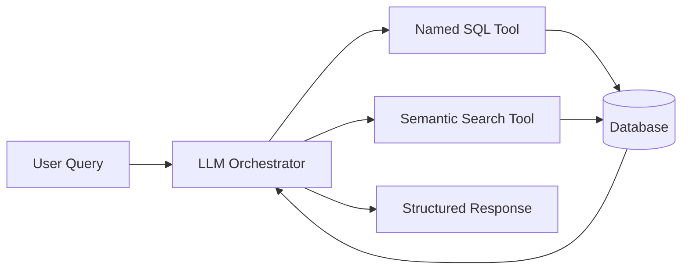

Cogniflow's chat interface uses an **LLM-powered agent** that can execute deterministic SQL queries and semantic searches to answer questions about wallet activity.

## Architecture

The chat system has three layers:

1. **LLM orchestrator** - Interprets user intent and selects tools
2. **Named SQL queries** - Pre-defined, safe SQL functions
3. **Semantic search** - Vector-based transaction discovery



## Named SQL queries

### Why named queries?

Instead of allowing the LLM to generate arbitrary SQL, Cogniflow uses **allowlisted named queries** for safety:

- ✅ **No SQL injection** - Parameters are validated with Zod schemas
- ✅ **Predictable performance** - Queries are pre-optimized
- ✅ **Auditable** - All queries are version-controlled in source

### Available queries

**File:** `web/lib/tools/sqlQueries.ts`

#### 1. `topCounterparties`

Finds the most active trading partners for a wallet.

**Schema:**

```typescript
const TopCounterpartiesParams = z.object({
  address: z.string().regex(/^0x[a-f0-9]{40}$/i).transform(v => v.toLowerCase()),
  chain: z.enum(["eth"]).default("eth"),
  start: z.string().refine(v => !isNaN(Date.parse(v))).transform(v => new Date(v)),
  end: z.string().refine(v => !isNaN(Date.parse(v))).transform(v => new Date(v)),
  limit: z.number().int().min(1).max(25).default(5),
});
```

**Query logic:**

```sql
WITH movements AS (
  SELECT
    CASE
      WHEN "from_addr" = $address THEN "to_addr"
      ELSE "from_addr"
    END AS counterparty,
    CASE
      WHEN "from_addr" = $address THEN -"amount_dec"
      ELSE "amount_dec"
    END AS signed_amount,
    CASE WHEN "from_addr" = $address THEN 0 ELSE "amount_dec" END AS incoming,
    CASE WHEN "from_addr" = $address THEN "amount_dec" ELSE 0 END AS outgoing
  FROM "transfers"
  WHERE "chain" = $chain
    AND "timestamp" BETWEEN $start AND $end
    AND ("from_addr" = $address OR "to_addr" = $address)
)
SELECT
  counterparty,
  SUM(signed_amount) AS total_volume,
  SUM(incoming)     AS incoming_volume,
  SUM(outgoing)     AS outgoing_volume,
  COUNT(*)::bigint  AS transfer_count
FROM movements
GROUP BY counterparty
ORDER BY SUM(incoming) DESC
LIMIT $limit;
```

**Returns:**

```typescript
[
  {
    counterparty: "0x123...",
    totalVolume: "15000.50",
    incomingVolume: "10000.00",
    outgoingVolume: "5000.50",
    transferCount: 42,
  },
  // ...
]
```

#### 2. `netFlowSummary`

Calculates net inflow/outflow for a wallet in a time period.

**Schema:**

```typescript
const NetFlowParams = z.object({
  address: addressSchema,
  chain: chainSchema.default("eth"),
  start: isoDateSchema,
  end: isoDateSchema,
});
```

**Query logic:**

```sql
WITH scoped AS (
  SELECT
    CASE WHEN "from_addr" = $address THEN 0 ELSE "amount_dec" END AS incoming,
    CASE WHEN "from_addr" = $address THEN "amount_dec" ELSE 0 END AS outgoing,
    CASE
      WHEN "from_addr" = $address THEN -"amount_dec"
      ELSE "amount_dec"
    END AS net_change,
    CASE WHEN "from_addr" = $address THEN 0 ELSE 1 END AS incoming_flag,
    CASE WHEN "from_addr" = $address THEN 1 ELSE 0 END AS outgoing_flag
  FROM "transfers"
  WHERE "chain" = $chain
    AND "timestamp" BETWEEN $start AND $end
    AND ("from_addr" = $address OR "to_addr" = $address)
)
SELECT
  COALESCE(SUM(incoming), 0)        AS incoming_volume,
  COALESCE(SUM(outgoing), 0)        AS outgoing_volume,
  COALESCE(SUM(net_change), 0)      AS net_volume,
  COALESCE(SUM(incoming_flag), 0)::bigint AS incoming_count,
  COALESCE(SUM(outgoing_flag), 0)::bigint AS outgoing_count
FROM scoped;
```

**Returns:**

```typescript
{
  incomingVolume: "50000.00",
  outgoingVolume: "30000.00",
  netVolume: "20000.00",
  incomingCount: 15,
  outgoingCount: 8,
}
```

### Executing named queries

The `/tool/sql` endpoint validates and executes queries:

```typescript
import { executeNamedQuery } from "@/lib/tools/sqlQueries";

// Example request
const request = {
  name: "topCounterparties",
  params: {
    address: "0x123...",
    chain: "eth",
    start: "2024-01-01T00:00:00Z",
    end: "2024-01-31T23:59:59Z",
    limit: 5,
  },
};

const result = await executeNamedQuery(request);
```

<Info>
  The LLM **never sees raw SQL**. It only receives the query name and schema.
</Info>

## LLM tool selection

The chat endpoint (`/api/chat`) provides the LLM with tool definitions:

```json
{
  "tools": [
    {
      "name": "topCounterparties",
      "description": "Find the most active trading partners for a wallet in a time range",
      "parameters": {
        "address": { "type": "string", "pattern": "^0x[a-f0-9]{40}$" },
        "start": { "type": "string", "format": "date-time" },
        "end": { "type": "string", "format": "date-time" },
        "limit": { "type": "integer", "minimum": 1, "maximum": 25, "default": 5 }
      }
    },
    {
      "name": "netFlowSummary",
      "description": "Calculate net inflow/outflow for a wallet in a time period",
      "parameters": {
        "address": { "type": "string" },
        "start": { "type": "string", "format": "date-time" },
        "end": { "type": "string", "format": "date-time" }
      }
    },
    {
      "name": "semanticSearch",
      "description": "Search for transfers using natural language (e.g., 'large stablecoin transfers')",
      "parameters": {
        "query": { "type": "string" },
        "address": { "type": "string" },
        "limit": { "type": "integer", "default": 50 }
      }
    }
  ]
}
```

The LLM selects the appropriate tool(s) based on the user's question.

## Example: Chat workflow

### User query

> "Who did I trade with most last month?"

### LLM reasoning

1. Parse intent: User wants **top counterparties**
2. Extract parameters:
   - `address`: User's wallet (from context)
   - `start`: First day of last month
   - `end`: Last day of last month
   - `limit`: 5 (default)
3. Call `topCounterparties` tool

### Tool execution

```json
{
  "tool": "topCounterparties",
  "params": {
    "address": "0x742d35Cc6634C0532925a3b844Bc9e7595f0bEb1",
    "chain": "eth",
    "start": "2024-01-01T00:00:00Z",
    "end": "2024-01-31T23:59:59Z",
    "limit": 5
  }
}
```

### Tool response

```json
[
  {
    "counterparty": "0xA0b86991c6218b36c1d19D4a2e9Eb0cE3606eB48",
    "totalVolume": "15000.50",
    "incomingVolume": "10000.00",
    "outgoingVolume": "5000.50",
    "transferCount": 42
  }
]
```

### LLM response

> "You traded most with **0xA0b86991c6218b36c1d19D4a2e9Eb0cE3606eB48** last month:
> - **42 transfers** totaling 15,000.50 tokens
> - Received: 10,000.00
> - Sent: 5,000.50
> - Net: +4,500.00"

<Tip>
  The LLM formats raw data into human-readable responses with context and insights.
</Tip>

## Adding new tools

### 1. Define the query

Add a new entry to `namedQueries` in `web/lib/tools/sqlQueries.ts`:

```typescript
const namedQueries = {
  // ... existing queries
  myNewQuery: {
    schema: z.object({
      address: addressSchema,
      // ... other params
    }),
    execute: async (params) => {
      const results = await prisma.$queryRaw`
        SELECT ...
        FROM transfers
        WHERE ...
      `;
      return results;
    },
  } satisfies QueryDefinition<typeof MyNewQueryParams>,
};
```

### 2. Update tool definitions

Add the tool to the LLM's context in `/api/chat`:

```json
{
  "name": "myNewQuery",
  "description": "What this query does",
  "parameters": { /* JSON schema */ }
}
```

### 3. Test the query

Use the `/tool/sql` endpoint to validate:

```bash
curl -X POST http://localhost:3000/tool/sql \
  -H "Content-Type: application/json" \
  -d '{
    "name": "myNewQuery",
    "params": { "address": "0x123...", ... }
  }'
```

<Warning>
  Never add queries that modify data (`INSERT`, `UPDATE`, `DELETE`). All tools should be **read-only**.
</Warning>

## Security considerations

### Parameter validation

All inputs are validated with **Zod schemas**:

```typescript
const addressSchema = z
  .string()
  .regex(/^0x[a-f0-9]{40}$/i)
  .transform((v) => v.toLowerCase());
```

This prevents:
- SQL injection
- Invalid addresses
- Type mismatches

### SQL injection prevention

Prisma's `$queryRaw` uses **parameterized queries**:

```typescript
// ✅ Safe (parameterized)
await prisma.$queryRaw`SELECT * FROM transfers WHERE chain = ${chain}`;

// ❌ Unsafe (string interpolation)
await prisma.$queryRawUnsafe(`SELECT * FROM transfers WHERE chain = '${chain}'`);
```

<Warning>
  **Never** use `$queryRawUnsafe` or string concatenation for user inputs.
</Warning>

### Rate limiting

The `/api/chat` endpoint should implement rate limiting to prevent abuse:

```typescript
// Example: 10 requests per minute per user
const rateLimit = new Map<string, { count: number; resetAt: number }>();
```

## Troubleshooting

<AccordionGroup>
  <Accordion title="LLM doesn't call the right tool">
    Improve the tool **description** to be more specific about when to use it.
  </Accordion>
  
  <Accordion title="Query returns no results">
    Check that:
    - The wallet address is correct and lowercase
    - The time range includes actual transfers
    - The `chain` parameter matches indexed data
  </Accordion>
  
  <Accordion title="Tool execution is slow">
    - Add database indexes for query columns
    - Reduce the time range or limit
    - Use `EXPLAIN ANALYZE` to optimize the query
  </Accordion>
</AccordionGroup>

## Next steps

<CardGroup cols={2}>
  <Card title="Chat API" icon="comments" href="/api/chat">
    Explore the chat endpoint documentation
  </Card>
  <Card title="Vector embeddings" icon="brain" href="/dev/vector-embeddings">
    Learn how semantic search works
  </Card>
</CardGroup>
