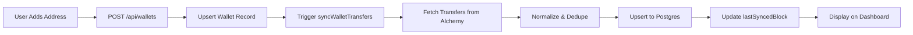

## Overview

Cogniflow's wallet tracking system allows you to monitor Ethereum wallet activity by connecting addresses and automatically ingesting on-chain data. Once added, wallets are continuously synced to capture ERC-20 transfers, balances, and transaction history.

<Info>
  Cogniflow currently supports Ethereum mainnet and Sepolia testnet. Support for additional chains is planned for future releases.
</Info>

## Adding a Wallet

To start tracking a wallet:

<Steps>
  <Step title="Enter wallet address">
    Paste the Ethereum address (starting with `0x`) into the wallet input field on your dashboard
  </Step>
  
  <Step title="Load activity">
    Click the **Load activity** button to add the wallet to your account
  </Step>
  
  <Step title="Automatic ingestion">
    Cogniflow immediately triggers an initial sync to fetch recent transfers (up to 1,500 blocks back by default)
  </Step>
</Steps>

<Tip>
  The first sync happens instantly when you add a wallet, so you'll see data within seconds for wallets with recent activity.
</Tip>

### How It Works

When you add a wallet:

1. **User Association** — The wallet is linked to your Supabase-authenticated user account
2. **Database Registration** — A wallet record is created with the chain (`eth`) and normalized address
3. **Initial Ingestion** — The system fetches both incoming and outgoing ERC-20 transfers from the last 1,500 blocks
4. **Data Normalization** — Transfers are deduplicated, enriched with token metadata (symbol, decimals), and stored in Postgres

<CardGroup cols={2}>
  <Card title="Lightweight Sync" icon="bolt">
    UI-triggered syncs are optimized for speed: they fetch up to 2 pages of transfer data and complete within seconds
  </Card>
  
  <Card title="Full Backfill" icon="database">
    Scheduled background jobs (via cron) perform deeper ingestion to capture historical transfers beyond the initial window
  </Card>
</CardGroup>

## Ingestion Process

Cogniflow uses a multi-stage ingestion pipeline to ensure data consistency:

### Transfer Discovery

- Queries the Alchemy API for ERC-20 asset transfers in both directions (incoming and outgoing)
- Fetches transfers within a block range: from `lastSyncedBlock + 1` to the latest chain head
- Processes results in pages to avoid RPC rate limits

### Data Enrichment

<Tabs>
  <Tab title="Token Metadata">
    Each transfer includes:
    - Token contract address
    - Symbol (e.g., USDT, DAI)
    - Decimals (for human-readable amounts)
    - Raw and decimal-formatted amounts
  </Tab>
  
  <Tab title="Block Metadata">
    Unique block numbers are resolved to:
    - Block hash
    - Parent hash
    - Timestamp
    
    This metadata is stored separately and linked to transfers for time-based queries.
  </Tab>
  
  <Tab title="Price Data">
    After ingestion, background jobs:
    - Fetch USD prices from CoinGecko for each token
    - Store spot prices in the `prices` table
    - Enable portfolio valuation in USD
  </Tab>
</Tabs>

### Deduplication & Storage

- Transfers are keyed by `txHash:logIndex` to prevent duplicates
- Upsert logic ensures re-syncing a range overwrites stale records
- All data is stored in normalized Postgres tables accessible via API

<Info>
  **Sync Throttling**: To avoid redundant requests, wallets are not re-synced if they were updated within the last 5 minutes (configurable via `UI_SYNC_MIN_INTERVAL_MS`).
</Info>

## Sync Status

Track ingestion progress using the sync metadata displayed on your dashboard:

| Field | Description |
|-------|-------------|
| **Last Synced Block** | The most recent block number ingested for this wallet (e.g., `#19,234,567`) |
| **Last Synced At** | Timestamp of the last successful sync (e.g., `Updated 2/28/2026, 3:45:12 PM`) |
| **Sync Pending** | Indicates the wallet has been added but ingestion hasn't completed yet |

<Warning>
  If a wallet shows "Waiting for first sync…" for more than a few minutes, check your RPC provider (Alchemy/Infura) configuration and rate limits.
</Warning>

## Wallet Lifecycle



### Background Sync Jobs

For deeper historical data, Cogniflow schedules three cron jobs:

<CardGroup cols={3}>
  <Card title="Ingestion" icon="download">
    `POST /api/ingest`
    
    Re-syncs all tracked wallets to capture new transfers since the last run
  </Card>
  
  <Card title="Prices" icon="dollar-sign">
    `POST /api/prices`
    
    Fetches USD spot prices for tokens from CoinGecko (free tier: 1 token/request)
  </Card>
  
  <Card title="Embeddings" icon="brain">
    `POST /api/embeddings`
    
    Generates vector embeddings for transfers to power semantic search
  </Card>
</CardGroup>

<Tip>
  Configure these jobs in Vercel Cron, GitHub Actions, or any scheduler that can POST to your API with the `Authorization: Bearer <INGESTION_SECRET>` header.
</Tip>

## Managing Multiple Wallets

You can track unlimited wallets per user account. Each wallet:

- Is associated with your Supabase user ID
- Maintains independent sync state (block cursor, last sync timestamp)
- Can be refreshed individually by re-entering the address and clicking **Load activity**

<Note>
  To switch between wallets in the dashboard, simply enter a different address in the input field and submit. Your previous wallets remain tracked in the background.
</Note>

## Configuration Options

Customize wallet tracking behavior via environment variables:

| Variable | Default | Description |
|----------|---------|-------------|
| `ETH_LOOKBACK_BLOCKS` | `5000` | Initial sync window when no cursor exists |
| `UI_SYNC_MAX_PAGES` | `2` | Max pages to fetch during UI-triggered syncs |
| `UI_SYNC_LOOKBACK_BLOCKS` | `1500` | Block lookback for lightweight syncs |
| `UI_SYNC_MIN_INTERVAL_MS` | `300000` (5 min) | Min time between re-syncs for the same wallet |
| `ETH_RPC_URL` | — | RPC endpoint (Alchemy, Infura, or custom node) |
| `NEXT_PUBLIC_ETHERSCAN_BASE_URL` | `https://etherscan.io` | Block explorer URL for transaction links |

<Warning>
  **Rate Limits**: Free-tier RPC providers (Alchemy, Infura) limit requests per second. If you track many wallets or run frequent syncs, consider upgrading your RPC plan.
</Warning>

## Troubleshooting

<AccordionGroup>
  <Accordion title="Wallet shows no transfers but I know it's active">
    Possible causes:
    - **Recent activity outside the lookback window**: Increase `UI_SYNC_LOOKBACK_BLOCKS` or wait for the next scheduled backfill
    - **Non-ERC-20 transfers**: Cogniflow currently indexes only ERC-20 tokens (native ETH and NFTs are not supported yet)
    - **Incorrect network**: Verify the wallet is active on Ethereum mainnet or Sepolia (the configured chain)
  </Accordion>
  
  <Accordion title="Sync is stuck on a stale block">
    Check:
    - RPC endpoint health (test with `curl $ETH_RPC_URL -X POST -H "Content-Type: application/json" -d '{"jsonrpc":"2.0","method":"eth_blockNumber","params":[],"id":1}'`)
    - Alchemy/Infura API key validity
    - Database connectivity (run `GET /api/healthz`)
    
    If the issue persists, manually trigger ingestion: `curl -X POST https://your-app.vercel.app/api/ingest -H "Authorization: Bearer <INGESTION_SECRET>"`
  </Accordion>
  
  <Accordion title="How do I remove a wallet?">
    Currently, wallets must be removed directly from the database:
    ```sql
    DELETE FROM wallets WHERE user_id = '<your-user-id>' AND address = '0x...';
    ```
    A UI-based wallet management page is planned for a future release.
  </Accordion>
</AccordionGroup>

## Next Steps

<CardGroup cols={2}>
  <Card title="Dashboard" href="/features/dashboard" icon="chart-line">
    View portfolio analytics, transfer history, and token holdings
  </Card>
  
  <Card title="Chat Interface" href="/features/chat-interface" icon="messages">
    Ask natural language questions about your wallet activity
  </Card>
</CardGroup>