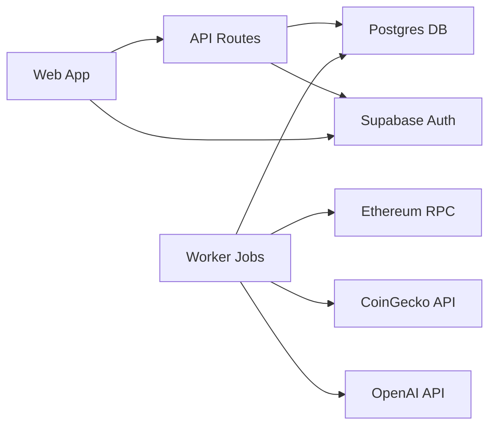

## What is Cogniflow?

Cogniflow is an on-chain intelligence agent that lets users explore wallet activity through a chat UI and a dashboard. It combines a lightweight indexer, normalized storage, vector search, and LLM-driven tool use to answer natural-language questions with charts and tables.

Built for developers who need production-ready on-chain analytics, Cogniflow provides both interactive exploration and programmatic access to Ethereum wallet data.

<CardGroup cols={2}>
  <Card
    title="Natural Language Chat"
    icon="comments"
    href="/features/chat-interface"
  >
    Ask questions in plain English and get structured answers powered by deterministic SQL tools and semantic search.
  </Card>
  <Card
    title="Real-Time Dashboard"
    icon="chart-line"
    href="/features/dashboard"
  >
    View portfolio summaries, token positions, transfer history, and sync status for any Ethereum address.
  </Card>
  <Card
    title="Powerful APIs"
    icon="code"
    href="/api/overview"
  >
    Access transfers, portfolio data, semantic search, and chat endpoints programmatically via REST APIs.
  </Card>
  <Card
    title="Production Ready"
    icon="rocket"
    href="/deployment/vercel"
  >
    Deploy to Vercel with scheduled jobs for continuous ingestion, price enrichment, and embeddings.
  </Card>
</CardGroup>

## Core Capabilities

<AccordionGroup>
  <Accordion title="Wallet Indexing" icon="database">
    - Connect Ethereum wallets (Sepolia or mainnet, read-only)
    - Ingest ERC-20 transfers and balances automatically
    - Track gas metrics and sync status per wallet
    - Idempotent ingestion keyed by `txHash:logIndex`
  </Accordion>

  <Accordion title="Normalized Storage" icon="table">
    - Postgres database with Prisma ORM
    - Blocks, transfers, price snapshots, and embeddings
    - pgvector extension for semantic search
    - Efficient indexes on addresses, tokens, and blocks
  </Accordion>

  <Accordion title="Price Enrichment" icon="dollar-sign">
    - CoinGecko integration for USD valuations
    - Hourly price snapshots stored per token
    - Automatic pricing for portfolio calculations
    - Support for free and Pro API tiers
  </Accordion>

  <Accordion title="Semantic Search" icon="search">
    - OpenAI embeddings for transfer descriptions
    - Vector similarity search over transaction history
    - LLM-powered discovery queries
    - Configurable batch processing
  </Accordion>

  <Accordion title="Chat Interface" icon="robot">
    - Natural language questions about wallet activity
    - Deterministic SQL tool execution
    - Structured data tables in responses
    - Source attribution and debug mode
  </Accordion>
</AccordionGroup>

## Tech Stack

<CardGroup cols={3}>
  <Card title="Frontend" icon="browser">
    - **Next.js 15** with React 19
    - **Tailwind CSS 4** for styling
    - **TypeScript** for type safety
    - Server and client components
  </Card>
  <Card title="Backend" icon="server">
    - **Node.js** workers for jobs
    - **Prisma** ORM with Postgres
    - **Supabase** Auth & Database
    - API routes in Next.js
  </Card>
  <Card title="Data & Infrastructure" icon="cloud">
    - **pgvector** for embeddings
    - **Alchemy/Infura** RPC
    - **Vercel** deployment
    - **CoinGecko** prices
  </Card>
</CardGroup>

## Architecture Overview

Cogniflow consists of three main components:

<Steps>
  <Step title="Web Application">
    Next.js 15 app with chat UI, dashboard, and API routes. Handles authentication via Supabase and serves the user interface.
  </Step>
  <Step title="Worker Jobs">
    Node.js scripts for ingestion, price enrichment, and embeddings. Scheduled via Vercel Cron or other schedulers.
  </Step>
  <Step title="Database">
    Supabase Postgres with pgvector extension. Stores blocks, transfers, prices, embeddings, users, and wallets.
  </Step>
</Steps>

<Note>
  Cogniflow is designed as a monorepo with two workspaces: `web/` for the Next.js app and `worker/` for background jobs.
</Note>

## Key Features

### For Users

- **Connect Any Wallet**: Paste an Ethereum address and start exploring immediately
- **Natural Questions**: "What were my largest outgoing USDT transfers last week?"
- **Portfolio Insights**: Total transfers, counterparties, net USD value, and token holdings
- **Transfer History**: Detailed view with timestamps, amounts, and Etherscan links

### For Developers

- **REST APIs**: Programmatic access to all data with pagination and filtering
- **TypeScript**: Full type safety across the stack
- **Modern Stack**: Built with the latest versions of Next.js, React, and Tailwind
- **Open Source**: Inspect, modify, and extend the codebase

## Use Cases

<CardGroup cols={2}>
  <Card title="Portfolio Analysis" icon="chart-pie">
    Track token holdings, net positions, and USD valuations for any Ethereum address over custom time windows.
  </Card>
  <Card title="Transaction Discovery" icon="magnifying-glass">
    Use semantic search to find specific transfers based on natural language descriptions.
  </Card>
  <Card title="Wallet Monitoring" icon="bell">
    Set up scheduled jobs to continuously ingest new transfers and keep analytics up to date.
  </Card>
  <Card title="Research & Analytics" icon="flask">
    Query historical transfer data programmatically for research, reporting, or integration with other tools.
  </Card>
</CardGroup>

## Getting Started

Ready to run Cogniflow locally or deploy it to production?

<CardGroup cols={2}>
  <Card
    title="Quickstart"
    icon="rocket"
    href="quickstart"
  >
    Get up and running in 5 minutes with a demo wallet
  </Card>
  <Card
    title="Architecture"
    icon="diagram-project"
    href="architecture"
  >
    Understand the system design and data flow
  </Card>
</CardGroup>

<Warning>
  Cogniflow is designed for **read-only** access to Ethereum data. It does not execute transactions or manage private keys.
</Warning>

## Community & Support

Have questions or ideas? We'd love to hear from you:

- Open an issue on GitHub for bugs or feature requests
- Start a discussion for general questions
- Check the API reference for endpoint documentation

<Check>
  **Next Step**: Follow the [Quickstart guide](/quickstart) to run Cogniflow locally with a demo wallet.
</Check>